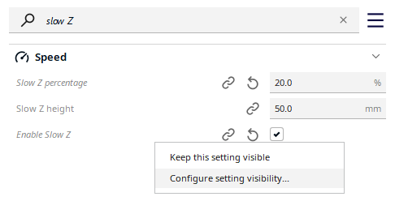

# Cura Slow Z

This Plugin is a modification of an initial existing Cura Plugin : [SlowZ](https://github.com/VMaxx/SlowZ) by [VMaxx](https://github.com/VMaxx)

This plugin adds a setting named "Slow Z percentage" to the speed settings in the Custom print setup of Cura. It will slow the printer speed as the layers increase.

The height of the modification beginning is define by the setting named "Slow Z height". *Note : In the original plugin mentioned therefore the modification was automaticaly done at 50% of the print height.*

The SlowZ setting can be found in the Custom print setup by using the Search field on top of the settings. If you want to make the setting permanently visible in the sidebar, right click and select "Keep this setting visible".

**This plugin assumes M220 will work with your printer.**

***WARNING***
This will override any manual speed adjustments you make, so if you decide during the print to adjust it.  The gcode is set for each layer to set the speed so it will go back to the percentage it calculates on the next layer.

## Options

        Slow Z percentage : Positive value to slow the print as the z value rises up to this percentage.
        Slow Z height : Positive value to define the start height of the speed reduction.
        Enable Slow Z : Activate Slow Z instruction via M220 GCode.

